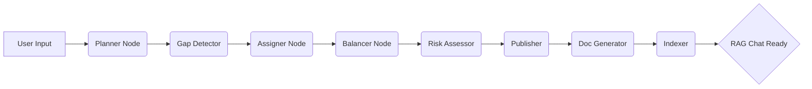

# 🧠 Ethos: Autonomous Multi-Agent System for Project Planning & Resource Allocation

[](https://github.com/venupagilla/Ethos-Multi-agent-project-planning)
[](https://opensource.org/licenses/MIT)
[](https://groq.com/)

**Ethos** is a high-performance, autonomous multi-agent system designed to streamline software project management. By utilizing advanced LLM orchestration via **LangGraph**, Ethos (formerly known as NeuraX) automates the journey from a raw project concept to a fully-staffed, risk-assessed, and documented project plan.

---

## 📖 Table of Contents
1.  [Core Vision](#-core-vision)
2.  [System Architecture](#-system-architecture)
3.  [The Agent Ecosystem](#-the-agent-ecosystem)
4.  [Key Features](#-key-features)
5.  [Technology Stack](#-technology-stack)
6.  [Project Structure](#-project-structure)
7.  [Getting Started](#-getting-started)
8.  [Usage Guide](#-usage-guide)
9.  [Integrations (MCP & RAG)](#-integrations)

---

## 🎯 Core Vision
The primary goal of Ethos is to remove the manual overhead and cognitive bias from project planning and resource allocation. It acts as an autonomous "Project Management Office" (PMO) that ensures:
-   **Contextual Accuracy:** Projects are decomposed into realistic technical tasks.
-   **Optimal Staffing:** Resources are assigned based on actual skill proficiency and current workload.
-   **Proactive Risk Management:** Timeline and skill-related risks are identified before the project starts.
-   **Instant Documentation:** Professional SRS and DRD documents are generated automatically.

---

## 🏗 System Architecture
Ethos uses a stateful directed acyclic graph (DAG) to manage its operations. This ensures that information flows seamlessly between specialized AI nodes.



### **The Pipeline Stages:**
1.  **Decomposition:** Breaking the project description into 5-10 actionable tasks.
2.  **Gap Analysis:** Checking if the current team has the required skills.
3.  **Assignment:** Intelligent matching of employees to tasks using the "Fitness Score" algorithm.
4.  **Rebalancing:** Adjusting assignments to ensure no employee exceeds a 90% workload.
5.  **Risk Assessment:** Evaluating the project's success probability based on assignments and constraints.
6.  **Publication:** Generating machine-readable (JSON) and human-readable (Markdown) reports.
7.  **Documentation:** Creating industry-standard SRS and DRD files.
8.  **Indexing:** Loading all output into a Vector DB for immediate RAG-powered querying.

---

## 🤖 The Agent Ecosystem
Ethos utilizes a hierarchical delegation model where a **SuperAgent** manages specialized experts:

| Agent | Persona | Specialization |
| :--- | :--- | :--- |
| **SuperAgent** | Chief of Staff | Orchestrates the delegation and result merging process. |
| **Planner Agent** | Technical Architect | Responsible for task breakdown and dependency mapping. |
| **Design Agent** | UI/UX Lead | Evaluates design-centric tasks and matches for aesthetic skills. |
| **Dev Agent** | Senior Engineering Manager | Handles development tasks and tech-stack matching. |
| **DevOps Agent** | Infra Architect | Manages cloud, deployment, and automation task assignments. |
| **Testing Agent** | QA Lead | Focuses on quality assurance and edge-case testing coverage. |

---

## ✨ Key Features

### **1. AI-Powered Task Decomposition**
Uses the `openai/gpt-4o-mini` (or better) model to interpret project goals and generate structured task lists including `task_id`, `title`, `description`, `required_skills`, and `estimated_days`.

### **2. Dynamic "Fitness Score" Matching**
Our proprietary assignment algorithm considers:
-   **Historical Skill Data:** Normalized using a synonym-mapping utility.
-   **Experience/Role Fit:** Ensuring the right seniority level handles the right task.
-   **Capacity Awareness:** Dynamically updating employee workload as assignments are made.

### **3. Autonomous Documentation**
-   **SRS (Software Requirements Specification):** Business logic, functional requirements, and scope.
-   **DRD (Design Reference Document):** System architecture, API design, and DB schema.

### **4. RAG-Integrated Project Intelligence**
Built-in `LangChain-RAG` system allows project managers to ask questions like:
-   *"What are the main risks for PRJ-109?"*
-   *"Does the team have enough Python experience for the backend tasks?"*

---

## 🛠 Technology Stack

### **Backend**
-   **Engine:** Python 3.10+
-   **API Framework:** FastAPI
-   **AI Logic:** LangChain + LangGraph
-   **Inference:** Groq Cloud (Llama 3 / GPT-4o-mini)
-   **Vector Search:** ChromaDB
-   **Database:** SQLite

### **Frontend**
-   **Framework:** Next.js (App Router)
-   **Styling:** Tailwind CSS + PostCSS
-   **Animation:** Framer Motion
-   **Smooth Scrolling:** Lenis

---

## 📁 Project Structure
```text
/
├── agent/                  # Core AI Engine
│   ├── features/           # Report Gen, Balancer, Risk, etc.
│   ├── tools/              # MCP Client, Vector Service
│   └── graph.py            # LangGraph Pipeline
├── frontend/               # Next.js Frontend Dashboard
├── data/                   # JSON & SQLite Persistence
├── output/                 # Generated MD & JSON Reports
└── server.py               # Main API Gateway
```

---

## 🚀 Getting Started

### **Prerequisites**
-   Python 3.10+
-   Node.js 18+
-   A [Groq API Key](https://console.groq.com/keys)

### **1. Clone & Install Backend**
```bash
git clone https://github.com/venupagilla/Ethos-Multi-agent-project-planning.git
cd Ethos-Multi-agent-project-planning
pip install -r requirements.txt
```

### **2. Setup Environment**
Copy `.env.example` to `.env` and add your Groq key:
```bash
GROQ_API_KEY=your_key_here
LLM_MODEL=openai/gpt-4o-mini
```

### **3. Start Servers**
**Backend:**
```bash
python server.py
# Server runs at http://localhost:8000
```

**Frontend:**
```bash
cd frontend
npm install
npm run dev
# Dashboard runs at http://localhost:3000
```

---

## 📬 Integrations

### **Gmail MCP**
Ethos integrates with the Model Context Protocol (MCP) to autonomously send assignment emails.
-   **Tool:** `gmail-mcp`
-   **Behavior:** On pipeline completion, the `send_emails_webhook` triggers, notifying relevant team members of their tasks.

### **RAG Documentation Chat**
Every project report and documentation is indexed in a vector store. The `/api/rag-chat` endpoint provides an interface for interacting with this data using semantic search.

---
*Developed with ❤️ for the Next Gen AI Hackathon*
